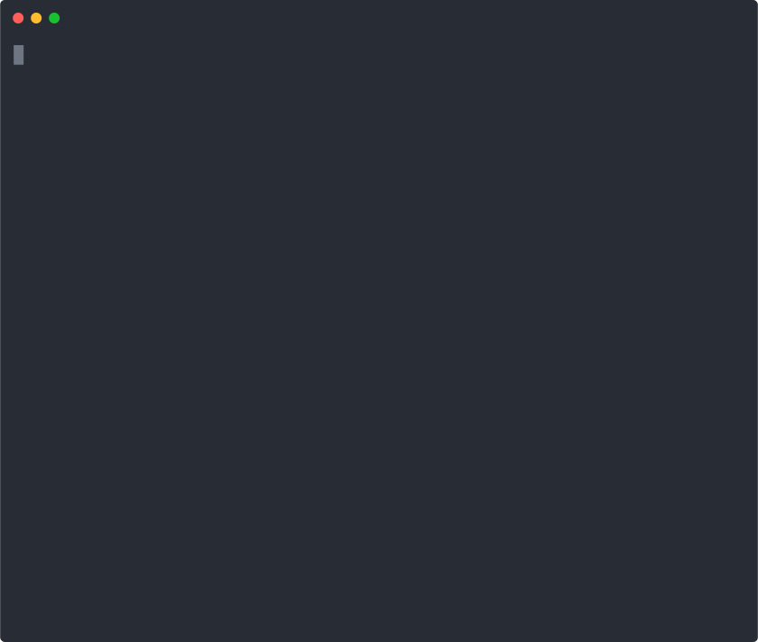

# Bamazon
A command-line storefront app with an interface for customers and employees. Built with NodeJS and MySQL.

## Installation

1. Clone this repository to your computer and install dependencies:
```
git clone https://www.github.com/adnanyousef/Bamazon.git 
cd Bamazon
npm install
```

2. Set up your MySQL credentials. Either open `connection.js` in your favorite text editor, or run the included `setup.js` script and choose the "Setup MySQL Credentials" option:
```
node setup.js
```

3. Set up the database by running the commands in `schema.sql` in your favorite MySql manager (ex. Sequel Pro), or run `node setup.js` and choose the "Create Database" option. This will get your database up and running, and fill it with some sample data.

4. Run the app with one of the following commands. Usage for each is documented below:
```bash 
node bamazonCustomer.js
node bamazonManager.js
node bamazonSupervisor.js
```

### Installation demo:
<p align='center'>

</p>

# Interfaces
## Customer
The `bamazonCustomer.js` file contains the interface intended for your customers. When your customers run `node bamazonCustomer.js`, the following will occur:
1. A table of your current iventory will be printed, displaying product names, IDs, departments, prices, and stock.
2. Customers will be prompted to enter the ID of the product they want to buy.
3. Customers will be asked how many units they want to buy.
4. Their total will be printed, and the inventory of the appropriate product will decrease. They may repeat this step until they complete their order. **NOTE**: if the customer wishes to buy more than what you have in stock, they will be alerted and taken back to the initial purchase prompt.

### Customer demo:
<p align='center'>

</p>

## Manager
The `bamazonManager.js` file provides an interface for store managers to view and modify inventory. The following commands are available:
1. `View Products For Sale`: This command will print a table of your current inventory, allowing easy access to important information on your products.
2. `View Low Inventory`: Print your current inventory that are low on stock.
3. `Add To Inventory`: Allows you to update your database when receiving more product.
4. `Add New Product`: Allows you to add more products to your inventory.

### Manager demo:
<p align='center'>

</p>

## Supervisor
The `bamazonSupervisor.js` file provides an interface for supervisors to view information about specific departments, such as overhead costs, sales per department, and profit per department. Sales per department and profit per department are calculated and updated when a customer buys product. Supervisors can also add new departments, which will then allow managers to add new products for the newly created department.

### Supervisor demo:
<p align='center'>

</p>

---

### Todo:
- [ ] Fix issue with "Creating Database" in setup script
- [x] Write documentation and installation instructions
- [x] Create GIF/SVG demos
 
### Bugs/future development
If you encounter a bug or think of a way to further improve this app, feel free to create an issue [here](https://www.github.com/adnanyousef/Bamazon/issues).

